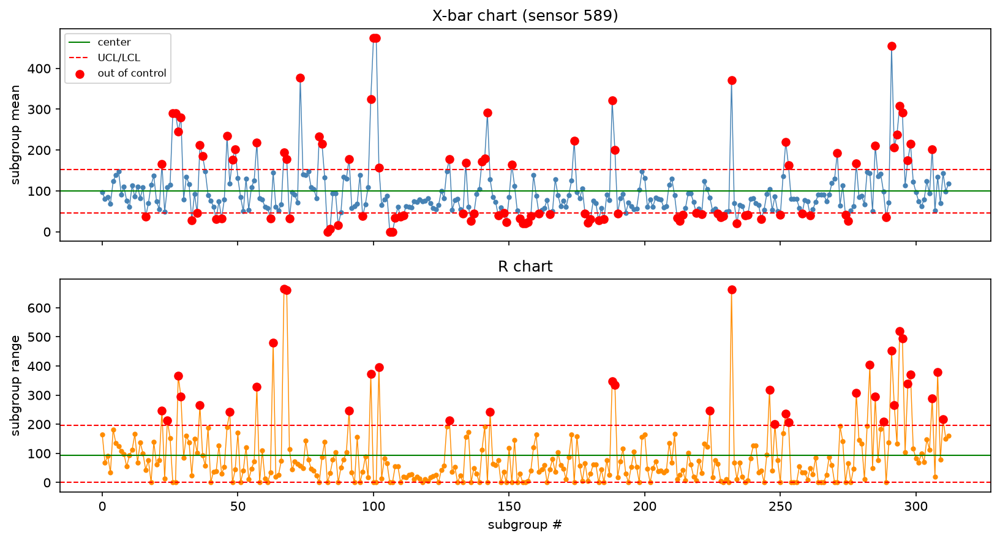
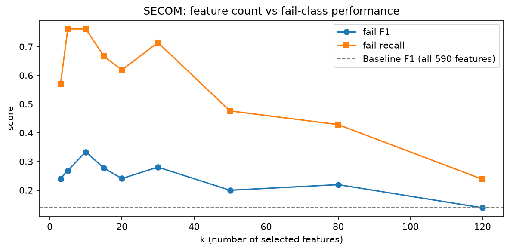
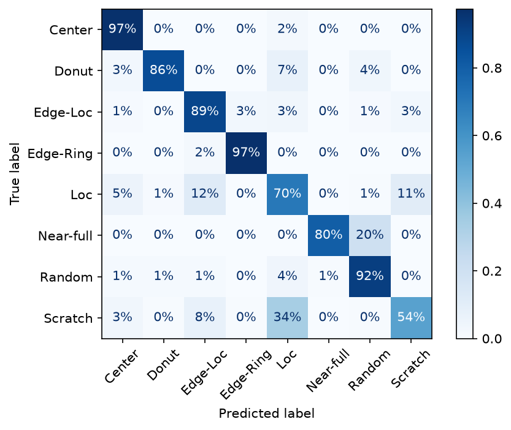
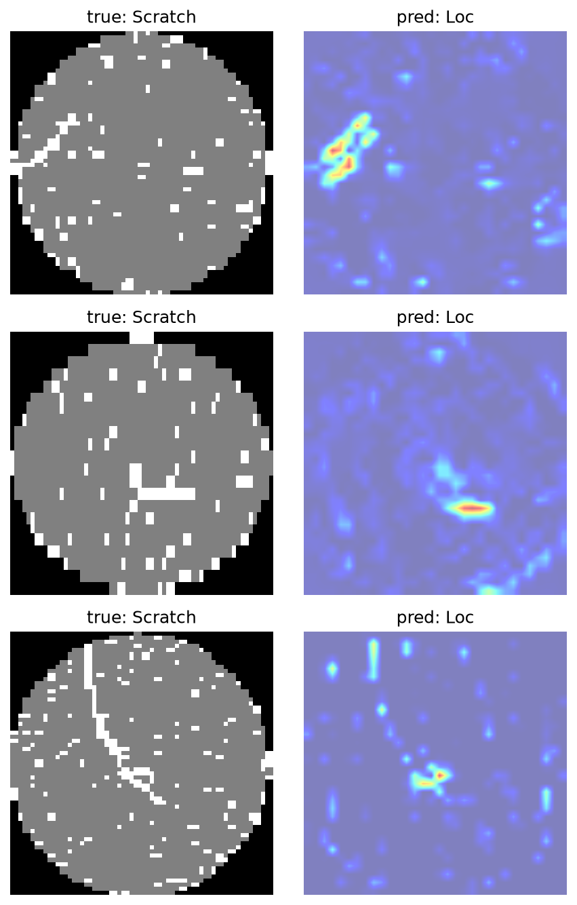

# 개발일지 (devlog)

> 신뢰도의 증거. 매 작업 세션마다 짧게라도 남긴다. "왜 이렇게 했는지 / 무엇이 안 됐는지"를
> 적어두면 (1) 면접에서 술술 설명되고 (2) AI가 대신 만든 게 아니라는 증거가 된다.
> 형식 자유. 3줄이라도 좋다.

---

## 2026-08-01 (킥오프)
- 한 일: 프로젝트 스캐폴딩(README·spc.py·01_eda.py·devlog), WM-811K(LSWMD.pkl 2GB)·SECOM 데이터 확보, `01_eda.py`로 데이터 로드 성공 → `df.shape = (811457, 6)`.
- 다음 할 일: 셀 2 — `label_str`로 `failureType`/`trianTestLabel` 중첩 배열 펴서 분포 확인, 웨이퍼맵 1장 시각화.

### 트러블슈팅 (LSWMD.pkl 로드)
1. **`No module named 'pandas.indexes'`** — 이 pkl은 옛 pandas(0.19대)로 저장됨. 당시 모듈명 `pandas.indexes`가 지금은 `pandas.core.indexes`로 개명됨.
   → 해결: `sys.modules`에 옛 이름을 현재 모듈로 별칭 연결(원본 수정 없이 읽는 쪽에 통역기 삽입).
   ```python
   sys.modules["pandas.indexes"] = pandas.core.indexes
   sys.modules["pandas.indexes.base"] = pandas.core.indexes.base
   ```
2. **`UnicodeDecodeError: 'ascii' codec can't decode byte 0x9a`** — 이 pkl은 Python 2로 저장됨. Py3 기본 ASCII 해석이 특수바이트에서 깨짐.
   → 해결: `pd.read_pickle` 대신 `pickle.load`를 직접 쓰며 `encoding="latin1"`로 로드.
   ```python
   with open(pkl, "rb") as f:
       df = pickle.load(f, encoding="latin1")
   ```
- 배운 점: 공개 레거시 데이터셋은 저장 당시의 라이브러리/파이썬 버전 차이로 바로 안 열릴 수 있고, 파일을 바꾸는 대신 **읽는 쪽 환경을 맞춰주는** 방식이 안전하다.

### 데이터 관찰 (라벨 구조 = 원본의 한계)
- `failureType`·`trianTestLabel` 둘 다 `label_str` 적용 시 `"unlabeled"`가 대량 등장. 버그 아니라 **원본 특성**:
  전체 811,457장 중 사람이 라벨링한 건 **172,950장뿐**, 나머지 **638,507장(79%)**은 빈 배열(`array([])`) → `unlabeled`.
- 라벨링이 "불량패턴 지정 + train/test 배정"을 한 세트로 진행돼서, 두 컬럼의 `unlabeled` 개수가 거의 동일.
- **함의**: 지도학습(분류)은 라벨된 172,950장만 사용 가능(`unlabeled` 필터링 필요). 남는 638k는 향후 비지도/준지도(이상탐지) 소재.
- **근거(문헌 확인)**: 이 라벨 부족은 WM-811K만의 quirk가 아니라 **반도체 제조 데이터의 일반적 문제**. 라벨링에 전문가 수작업이 필요해 실제 팹에서도 극히 일부만 라벨됨 + 클래스 불균형이 심해, 미라벨 데이터를 함께 쓰는 **준지도학습(SSL)** 연구가 활발.
  - WM-811K에서 172,950 라벨 / 638,507 미라벨 명시: [Wafer Map Defect Patterns Semi-Supervised Classification (arXiv:2311.12840)](https://arxiv.org/pdf/2311.12840)
  - 리뷰 논문(팹 결함 검출의 데이터·알고리즘 정리): [Review of wafer defect detection in semiconductor manufacturing (J. Intelligent Manufacturing, Springer)](https://link.springer.com/article/10.1007/s10845-026-02845-z)
  - 업계 매체 설명: [Wafer Bin Map Defect Classification Using Semi-Supervised Learning (SemiEngineering)](https://semiengineering.com/wafer-bin-map-defect-classification-using-semi-supervised-learning/)


## 2026-08-05 (W2) — SPC 구현·시각화
- 한 일: spc.py에 process_capability(Cp/Cpk)·xbar_r_limits(관리도)·out_of_control_points 구현, 02_spc.py에서 SECOM 실열에 적용해 X-bar/R 차트 시각화(이탈점 강조).

- 배운 점(코딩): NumPy 벡터화(`.mean(axis=1)`가 for문을 대신), pandas 다중조건은 각 비교를 `()`로 감싸야 함(`&` 우선순위).
- 한계/캐비아: SECOM은 단일 공정의 균일 시계열이 아니고 subgroup을 임의(연속 5개)로 잘랐으며, 관리한계선을 같은 데이터로 산출(Phase 1). → 이 관리도는 **SPC 방법론 시연**이지 해당 센서 공정에 대한 품질 판정이 아님.
- 다음: SECOM pass/fail baseline 분류 + 유효 인자(feature) 선별.

## 2026-08-06 (W2) - SECOM Baseline
- SECOM data를 기반으로 pass/fail을 예측하는 baseline model을 만듦
- 이 과정에서 로지스틱 회귀를 사용하였고, fail f1 = 0.14, fail recal = 0.19의 좋지 않은 결과를 가짐
- 결과가 별로인 이유는 590 features인데 X_train의 개수가 1253개였기 때문. 즉 1253개의 데이터를 기반으로 590개 값을 정해야 함. 이 비율이 10:1 정도까지는 올라가야 안정적으로 모델을 학습시킬 수 있음.
- 고로, feature 개수를 줄이거나 X_train 수를 늘려야 하는데, 후자는 SECOM 데이터셋의 한계로 불가능하므로 (내가 집에서 만드는 데이터가 아니므로) feature 중 유효한 것들을 뽑아내는 유효 인자 선별 단계로 넘어가야 함.

## 2026-08-07 (W2) - SECOM Baseline - Effective Feature Selection
[개념적으로 배운 점]
- 유효인자 선별 방법에는 Filter, Wrapper, Embedded의 3가지 방식이 있다.
1. Filter: 각 feature가 얼마나 Pass/Fail과 연관이 있는 지를 점수로 매겨, 해당 점수가 높은 k개의 features만 남기는 방식.
- 예시: ANOVA F-검정, 상호정보량
2. Wrapper: feature 조합을 바꿔가며 모델을 반복 학습해 최적 조합 탐색. 정확하지만 느리다는 단점이 있음.
- 예시: RFE
3. Embedded: 모델이 학습하면서 스스로 걸러냄.
- 예시: L1/Lasso가 쓸모없는 계수를 0으로 처리, 트리의 Feature Importance 개념.

[코딩적으로 배운 점]
- imputer와 scaler는 unsupervised learning으로 fit/transform에 x value만 있으면 되나
- selector는 supervised learning이니, fit/transform에 y value도 필요하다

[한 일]
- 우리는 ANOVA F-검정을 선택. 특정 feature가 Pass/Fail 집단에서 평균값이 많이 다른 지를 확인. 많이 다른 feature 상위 k개만 선별.
- SelectKBest(f_classif, k)로 상위 k개 선별 후 재학습. selector도 train으로만 fit(leakage 방지).

[결과]
- baseline(590 feat): fail f1=0.14, recall=0.19 (불량 4/21 검출)
- k=30: f1=0.28, recall=0.71 / k=10: f1=0.33, recall=0.76 (불량 16/21)
- k-sweep(3~120) 결과 best k=10. 590→10으로 줄여 과적합↓ → 일반화↑.

- 핵심: recall 0.19→0.76으로 급상승 (품질에서 제일 중요한 "불량 안 놓치기"가 좋아짐). f1도 2배+.
- 트레이드오프: precision은 여전히 낮음(~0.21, false alarm 다수). 단 반도체 품질은 불량 놓침(FN)이 헛경보(FP)보다 치명적이라 recall 우선 방향은 타당.
- 산출물: "k vs fail-F1/recall" 곡선 → 향후 README의 핵심 figure 후보.

[다음]
- (W3) 이상탐지(Isolation Forest/Autoencoder) + WM-811K CNN 불량분류.

## 2026-08-14 - Load LSWMD data and filter only 8 failures
[한일]
- CNN 불량분석을 하기 위해서 LSWMD 데이터를 로드하고, 8개의 오류 케이스만으로 필터링했다.
- 상당히 많은 데이터가 unlabeled거나 none(불량이 아님)임을 알게 되었다.
- 이후 이 2D 데이터를 CNN으로 불량분석 할 예정이다.

## 2026-08-15 - Resize LSWMD data and label encoding
[한일]
- 웨이퍼맵은 사이즈가 다양하나, CNN은 고정된 규격을 요구하므로 64*64로 리사이즈한다.
- 이후 (25519, 64, 64, 1)로 변환한다. 1은 채널의 수로, CNN에서 요구하는 값이다.
- 8개 실패 라벨의 경우, 텍스트 말고, one-hot으로 변환한다. 이는 softmax 및 categorical_crossentropy와의 합치를 위한 것이다.

## 2026-08-15 - Stratified Split (Train, Val, Test)
[한일]
- 불량 케이스 중 Near-full과 같은 경우 149개 밖에 없기 때문에, split 별 비율을 유지하는 Stratified Split을 활용한다.
- 전체 중 Test를 20%로 먼저 뗀다.
- 남은 것 중 20%를 Val로 뗀다. 이후 남은 것이 Train 데이터가 된다.

## 2026-08-15 - CNN Model Define and Training
[한일]
- Model define: [Conv2D -> Conv2D -> MaxPooling2D] *2 -> Flatten -> Dense -> Dropout -> Dense(softmax)
- Model Train: balanced weights + EarlyStopping of "val_loss"&restore_best_weights

[결과데이터]
- 13회차에서 가장 좋은 결과가 나옴. 4회의 patience를 설정하였으므로, 17회에서 학습은 종료됨
Epoch 13/30
256/256 ━━━━━━━━━━━━━━━━━━━━ 43s 166ms/step - accuracy: 0.9124 - loss: 0.2104 - val_accuracy: 0.8969 - val_loss: 0.2868

## 2026-08-21 - CNN 최종 평가 (per-class F1 + Confusion Matrix)
[한일]
- 끝까지 안 건드린 test set으로 최종 평가 진행.
- accuracy는 불균형에서 착시(다수 클래스만 맞혀도 높게 나옴)가 발생할 수 있어, per-class F1/recall + confusion matrix로 정직하게 측정한다.
- confusion matrix는 행 기준 정규화(%)로 그려, Edge-Ring(다수 클래스)이 색 범위를 독점하는 문제를 해소.

[결과데이터]
- accuracy 0.887 / macro F1 0.826 / weighted F1 0.887
- 소수 클래스도 살아남: Near-full recall 0.967 / F1 0.841, Donut recall 0.901 / F1 0.847
- 즉, balanced로 학습시킨 CNN 모델이 실제로 효과적이었음을 알 수 있음.
- per-class F1: Edge-Ring 0.974, Center 0.946, Random 0.891, Edge-Loc 0.864, Donut 0.847, Near-full 0.841, Loc 0.756, Scratch 0.489
- 약점: Scratch의 F1이 0.489로 유의미하게 낮다. 정규화 confusion matrix 기준, scratch의 40%가 Loc으로 오분류되고 있다.


[배운점/해석]
- class_weight는 학습 단계에서 불균형 보정을 개입한 것 + per-class 결과는 그것의 효과를 입증하는 단계. 둘 다 필요하며 상보적이다.
- Scratch, Loc, Edge-Loc의 경우 공간적으로 비슷해서 모델이 제대로 분류해내지 못 했다. 이는 실제로도 비슷하게 생긴 오류라서 인간도 분류하기 어려움.

[다음]
- Scratch 개선 방법 확인 (데이터를 증강하거나 해상도를 높이거나)

## 2026-08-22 - Grad-CAM (모델이 보는 근거 시각화)
[한일]
- 08/21에서 확인한 최대 약점 Scratch→Loc 오분류가 "왜" 일어나는지 Grad-CAM으로 확인.
- 마지막 Conv2D(conv2d_3)의 특징맵을, 예측 클래스 점수에 대한 gradient로 가중합 → 어느 영역이 그 예측을 밀었는지 히트맵으로 시각화.
- Scratch→Loc 오분류 test 인덱스 [27, 89, 108, 112, 149] 중 [0,3,4]번을 시각화. Scratch↔Edge-Loc 조합으로도 바꿔 돌려 재현성 확인.

[결과/해석]
- 세 사례 모두 히트맵이 노이즈가 아니라 **실제 스크래치 궤적**에 집중됨 → 모델은 결함 위치 자체는 옳게 짚음.
- 다만 스크래치의 **국소 구간(짧고 뭉친 부분)**에 반응 → 선형 궤적을 "국소 덩어리(Loc)"로 해석. 즉 오류의 원인은 오작동이 아니라 **Scratch↔Loc의 형태적 경계 모호성**.
- 공간적으로 비슷하다는 것의 **시각적 근거**가 됨. Grad-CAM이 도메인 해석을 뒷받침.


[트러블슈팅]
- Keras 3의 Sequential은 내부 층의 .output 심볼릭 텐서가 없어 `Model(model.inputs, [layer.output, model.output])`가 "never been called"로 실패.
  → 새 Input을 model.layers에 다시 통과시켜 (마지막 conv 출력, 최종 예측)을 뱉는 grad_model을 재구성하는 방식으로 해결(가중치 공유).

[다음]
- 경험기술서 2편 작성(양산기술 프레이밍) — Grad-CAM 그림을 ② AI 문제해결 근거로 사용.